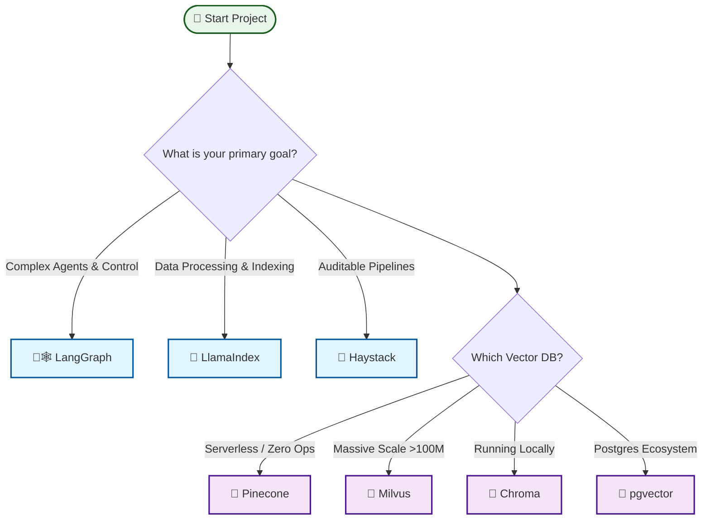

# Awesome RAG Production

<!-- markdownlint-disable MD033 -->

<!-- markdownlint-enable MD033 -->

> A curated collection of battle-tested tools, frameworks, and best practices for
> building, scaling, and monitoring production-grade
> Retrieval-Augmented Generation (RAG) systems.

The transition from a "Hello World" RAG tutorial to a scalable, reliable
production system is filled with challenges—from data parsing at scale to
ensuring retrieval precision and system observability. This repository focuses
on the **Engineering** side of AI.

Contribution Guide · [Explore Categories](#-contents) · [Report Bug](https://github.com/Yigtwxx/Awesome-RAG-Production/issues)

---

## 📑 Contents

- [Frameworks & Orchestration](#%EF%B8%8F-frameworks--orchestration)
- [Data Ingestion & Parsing](#-data-ingestion--parsing)
- [Vector Databases](#%EF%B8%8F-vector-databases)
- [Retrieval & Reranking](#-retrieval--reranking)
- [Evaluation & Benchmarking](#-evaluation--benchmarking)
- [Observability & Tracing](#%EF%B8%8F-observability--tracing)
- [Deployment & Serving](#-deployment--serving)
- [Recommended Resources (Books & Blogs)](#-recommended-resources)

---

## 🧭 Decision Guide: How to Choose

Not sure where to start? Use this high-level decision tree to pick the right
tools for your scale and use case.

---

## 🧱 Reference Architectures

Stop guessing. Here are three battle-tested stacks for different stages of
maturity.

### 1. The Local / Dev Stack (Zero to One)

**Goal:** Rapid prototyping, zero cost, no API keys.

**Stack:**

- **LLM:** **Ollama** (LLaMA 3 / Mistral)
- **Vector DB:** **Chroma** (Embedded)
- **Eval:** **Ragas** (Basic checks)

**Why:** Runs entirely on your laptop. Perfect for "Hello World" and checking
feasibility.

**Risks:** High latency; performance depends on your hardware; no horizontal
scaling.

**Observability Checklist:** `print()` statements and basic logging.

### 2. The Mid-Scale / Production Stack (Speed to Market)

**Goal:** High precision, developer velocity, minimal infra management.

**Stack:**

- **Vector DB:** **Qdrant** or **Weaviate** (Cloud/Managed)
- **Reranker:** **Cohere Rerank** (API)
- **Tracing:** **Langfuse** or **Arize Phoenix**

**Why:** Offloads complexity to managed services. "It just works" with great documentation.

**Risks:** Costs scale linearly with usage; dependency on external APIs (Vendor
lock-in).

**Observability Checklist:** Latency tracking, Token usage costs, Trace
visualization.

### 3. The Enterprise / High-Scale Stack (The 1%)

**Goal:** Throughput maximization, data sovereignty, full control.

**Stack:**

- **Vector DB:** **Milvus** (Distributed)
- **Serving:** **vLLM** (Self-hosted)
- **Eval (CI/CD):** **DeepEval**
- **Monitoring:** **OpenLIT** (OpenTelemetry)

**Why:** You own the data and the compute. Scales to billions of vectors.

**Risks:** Significant operational complexity (Kubernetes); requires a dedicated Platform Engineering team.

**Observability Checklist:** Distributed tracing, Embedding drift detection, Custom SLA alerts, GPU utilization metrics.

---

## 🏗️ Frameworks & Orchestration

- [Cognita](https://github.com/truefoundry/cognita)
  - A modular RAG framework by TrueFoundry designed for scalability. It decouples
    the RAG components (Indexer, Retriever, Parser), allowing for independent
    scaling and easier AB testing of different RAG strategies.
- [Haystack](https://github.com/deepset-ai/haystack)
  - A modular framework focused on production readiness. It emphasizes audible
    pipelines, strict type-checking, and reproducibility, making it ideal for
    enterprise-grade RAG where reliability is paramount.
- [LangGraph](https://github.com/langchain-ai/langchain)
  - A library for building stateful, multi-actor applications with LLMs. Unlike
    simple chains, it enables cyclic graphs for complex, agentic workflows with
    human-in-the-loop control and persistence.
- [LlamaIndex](https://github.com/run-llama/llama_index)
  - The premier data framework for LLMs. It excels at connecting custom data
    sources to LLMs, offering advanced indexing strategies (like recursive
    retrieval) and optimized query engines for deep insight extraction.
- [Pathway](https://github.com/pathwaycom/pathway)
  - A high-performance data processing framework for live data. It enables
    "Always-Live" RAG by syncing vector indices in real-time as the underlying
    data source changes, without full re-indexing.
- [RAGFlow](https://github.com/infiniflow/ragflow)
  - An end-to-end RAG engine designed for deep document understanding. It handles
    complex layouts (PDFs, tables, images) natively and includes a built-in
    knowledge base management system.
- [Verba](https://github.com/weaviate/Verba)
  - Weaviate's "Golden RAGtriever". A fully aesthetic, open-source RAG web
    application that comes pre-configured with best practices for chunking,
    embedding, and retrieval out of the box.

## 📥 Data Ingestion & Parsing

- [Firecrawl](https://github.com/mendableai/firecrawl)
  - Effortlessly turn websites into clean, LLM-ready markdown.
- [LlamaParse](https://github.com/run-llama/llama_parse)
  - Specialized parsing for complex PDFs with table extraction capabilities.
- [Marker](https://github.com/VikParuchuri/marker)
  - High-efficiency PDF, EPUB to Markdown converter using vision models.
- [OmniParse](https://github.com/adithya-s-k/omniparse)
  - Universal parser for ingesting any data type (documents, multimedia, web)
    into RAG-ready formats.
- [Unstructured](https://github.com/Unstructured-IO/unstructured)
  - Open-source pipelines for preprocessing complex, unstructured data.

## 🗄️ Vector Databases

| Tool | Best For | Key Strength |
| :--- | :--- | :--- |
| **[Chroma](https://github.com/chroma-core/chroma)** | Local/Dev & Mid-scale | Developer-friendly, open-source embedding database. |
| **[Milvus](https://github.com/milvus-io/milvus)** | Billions of vectors | Most popular OSS for massive scale. |
| **[pgvector](https://github.com/pgvector/pgvector)** | PostgreSQL Ecosystem | Vector search capability directly within PostgreSQL. |
| **[Pinecone](https://www.pinecone.io/)** | 10M-100M+ vectors | Zero-ops, serverless architecture. |
| **[Qdrant](https://github.com/qdrant/qdrant)** | <50M vectors | Best filtering support and free tier. |
| **[Weaviate](https://github.com/weaviate/weaviate)** | Hybrid Search | Native integration of vector and keyword search. |

## 🔍 Retrieval & Reranking

**Hybrid Search:**
A retrieval strategy that linearly combines Dense Vector Search (semantic
understanding) with Sparse Keyword Search (BM25 for exact term matching). This
mitigates the "lost in the middle" phenomenon and significantly improves
zero-shot retrieval performance.

- [BGE-Reranker](https://huggingface.co/BAAI/bge-reranker-v2-m3)
  - One of the best open-source rerankers available. It is a cross-encoder model
    trained to output a relevance score for query-document pairs, offering
    commercial-grade performance for self-hosted pipelines.
- [Cohere Rerank](https://cohere.com/rerank)
  - A powerful API-based reranking model. By re-scoring the initial top-K
    documents from a cheaper/faster retriever, it drastically improves precision
    (often boosting MRR by 10-20%) with minimal code changes.
- [FlashRank](https://github.com/PrithivirajDamodaran/FlashRank)
  - A lightweight, serverless-friendly reranking library. It runs quantized
    cross-encoder models directly in the CPU (no Torch/GPU required), making it
    ideal for edge deployments or cost-sensitive architectures.
- [RAGatouille](https://github.com/bclavie/RAGatouille)
  - A library that makes ColBERT (Contextualized Late Interaction over BERT)
    easy to use. ColBERT offers fine-grained token-level matching, providing
    superior retrieval quality compared to standard single-vector dense
    retrieval.

**GraphRAG:**
An advanced retrieval method that constructs a knowledge graph from documents. It
traverses relationships between entities to answer "global" queries (e.g., "What
are the main themes?") that standard vector search struggles to address.

## 📊 Evaluation & Benchmarking

Reliable RAG requires measuring the **RAG Triad**: Context Relevance,
Groundedness, and Answer Relevance.

- [Ares](https://github.com/stanford-futuredata/ARES)
  - An automated evaluation system that helps you evaluate RAG systems with fewer
    human labels. It uses prediction-powered inference to provide statistical
    confidence intervals for your system's performance.
- [Braintrust](https://www.braintrust.dev/)
  - An enterprise-grade platform for evaluating and logging LLM outputs. It
    excels at "Online Evaluation," allowing you to score real-world user
    interactions and feed that data back into your development set.
- [DeepEval](https://github.com/confident-ai/deepeval)
  - The "Pytest for LLMs". It offers a unit-testing framework for RAG,
    integrating seamlessly into CI/CD pipelines to catch regression in retrieval
    quality or hallucination rates before deployment.
- [Ragas](https://github.com/explodinggradients/ragas)
  - A framework that uses an "LLM-as-a-Judge" to evaluate your pipeline. It
    calculates metrics like Faithfulness (did the answer come from the context?)
    and Answer Relevancy without needing human-labeled ground truth.

## 👁️ Observability & Tracing

- [Arize Phoenix](https://github.com/Arize-ai/phoenix)
  - A tool specifically designed for troubleshooting retrieval issues. It
    visualizes your embedding clusters and retrieved document rankings, helping
    you understand *why* the model retrieved irrelevant context.
- [Langfuse](https://github.com/langfuse/langfuse)
  - An open-source engineering platform for LLM observability. It captures full
    execution traces (latency, token usage, cost) and allows for "Prompt
    Management," letting you version-control prompts decoupled from your code.
- [LangSmith](https://www.langchain.com/langsmith)
  - Built by the LangChain team, this is the gold standard for debugging complex
    chains. It provides a "Playground" to rerun specific traces with modified
    prompts to iterate on edge cases instantly.
- [OpenLIT](https://github.com/openlit/openlit)
  - An OpenTelemetry-native monitoring solution. If you already use
    Prometheus/Grafana or Datadog, OpenLIT drops into your existing stack to
    provide standardized LLM metrics (GPU usage, token throughput).

## 🚀 Deployment & Serving

- [BentoML](https://github.com/bentoml/BentoML)
  - A framework for packaging models into standardized APIs (Bentos). It handles
    the complexity of adaptive batching and multi-model serving, allowing you to
    deploy any model to any cloud (AWS Lambda, EC2, Kubernetes) with one
    command.
- [Ollama](https://github.com/ollama/ollama)
  - The easiest way to run LLMs locally. While primarily for dev/local use, it
    bridges the gap between local testing and deployment by providing a standard
    API for models like LLaMA 3, Mistral, and Gemma.
- [Ray Serve](https://github.com/ray-project/ray)
  - The industry standard for scaling Python ML workloads. It allows you to
    compose complex pipelines (e.g., Retriever + Reranker + LLM) where each
    component scales independently across a cluster of machines.
- [vLLM](https://github.com/vllm-project/vllm)
  - A high-performance inference engine known for PagedAttention. It maximizes
    GPU memory utilization, allowing you to serve larger models or handle higher
    concurrency with lower latency than standard Hugging Face Transformers.

## 🛡️ Security & Compliance

- [Lakera Guard](https://www.lakera.ai/)
  - A low-latency security API that protects applications against prompt
    injections, data leakage, and toxic content in real-time. It acts as an
    "Application Firewall" for your LLM.
- [LLM Guard](https://github.com/protectai/llm-guard)
  - A comprehensive toolkit for sanitizing inputs and outputs. It detects
    invisible text, prompt injections, and anonymizes sensitive data, ensuring
    full compliance with data privacy standards.
- [NeMo Guardrails](https://github.com/NVIDIA/NeMo-Guardrails)
  - The standard for adding programmable guardrails to LLM-based conversational
    systems. It prevents "Jailbreaking" and ensures models stay on topic,
    critical for enterprise chatbots.
- [Presidio](https://github.com/microsoft/presidio)
  - Microsoft’s SDK for PII (Personally Identifiable Information) detection and
    redaction. It ensures sensitive user data (credit cards, emails) is scrubbed
    *before* it hits the embedding model or vector DB.
- [PrivateGPT](https://github.com/zylon-ai/private-gpt)
  - A production-ready project that allows you to run RAG pipelines completely
    offline. It ensures 100% data privacy by keeping all ingestion and inference
    local, perfect for highly regulated industries.

## 🧠 Recommended Resources

Deepen your knowledge with curated lists of books and blogs from industry
experts.

### 📚 [Books](books.md)

A curated list of **Essential Books** covering RAG, Deep Learning, and AI
Engineering.

- *Featuring: "Designing Machine Learning Systems" by Chip Huyen, "Deep
  Learning" by Goodfellow et al.*

### 🌐 [Blogs & News](blogs.md)

Stay updated with the **Best Engineering Blogs**.

- *Featuring: OpenAI Research, Google DeepMind, and NVIDIA AI.*

---

## 🛠️ Selection Criteria

To keep this list high-quality, we only include resources that are:

**1. Production-Ready:** Battle-tested in real-world environments.

**2. Actively Maintained:** Regular updates within the last 3-6 months.

**3. Documented:** Strong API references and clear use cases.

---

## 🤝 Contributing

Contributions are welcome! Please read the [CONTRIBUTING.md](CONTRIBUTING.md)
file for guidelines on how to submit a new resource.

---

## 📜 License

This repository is licensed under [CC0 1.0 Universal](LICENSE).
