# Awesome RAG Production

> A curated collection of battle-tested tools, frameworks, and best practices for building, scaling, and monitoring production-grade Retrieval-Augmented Generation (RAG) systems.

The transition from a "Hello World" RAG tutorial to a scalable, reliable production system is filled with challenges—from data parsing at scale to ensuring retrieval precision and system observability. This repository focuses on the **Engineering** side of AI.

[Contribution Guide](CONTRIBUTING.md) · [Explore Categories](#contents) · [Report Bug](https://github.com/Yigtwxx/Awesome-RAG-Production/issues)

---

## 📑 Contents
- [Frameworks & Orchestration](#frameworks--orchestration)
- [Data Ingestion & Parsing](#data-ingestion--parsing)
- [Vector Databases](#vector-databases)
- [Retrieval & Reranking](#retrieval--reranking)
- [Evaluation & Benchmarking](#evaluation--benchmarking)
- [Observability & Tracing](#observability--tracing)
- [Deployment & Serving](#deployment--serving)
- [Recommended Resources (Books & Blogs)](#-recommended-resources)

---

## 🧭 Decision Guide: How to Choose?

Not sure where to start? Use this high-level decision tree to pick the right tools for your scale and use case.

```mermaid
graph TD
    Start([🚀 Start Project]) --> UseCase{What is your primary goal?}
    
    %% Framework Selection
    UseCase -->|Complex Agents & Control| LangGraph[🦜🕸️ LangGraph]
    UseCase -->|Data Processing & Indexing| LlamaIndex[🦙 LlamaIndex]
    UseCase -->|Auditable Pipelines| Haystack[🌾 Haystack]
    
    %% Vector DB Selection
    UseCase --> DB{Which Vector DB?}
    DB -->|Serverless / Zero Ops| Pinecone[🌲 Pinecone]
    DB -->|Massive Scale >100M| Milvus[🚀 Milvus]
    DB -->|Running Locally| Chroma[🧪 Chroma]
    DB -->|Postgres Ecosystem| PGVector[🐘 pgvector]
    
    %% Styling
    classDef framework fill:#e1f5fe,stroke:#01579b,stroke-width:2px;
    classDef db fill:#f3e5f5,stroke:#4a148c,stroke-width:2px;
    classDef start fill:#e8f5e9,stroke:#1b5e20,stroke-width:2px;
    
    class LangGraph,LlamaIndex,Haystack framework;
    class Pinecone,Milvus,Chroma,PGVector db;
    class Start start;
```

---

## 🏗️ Frameworks & Orchestration
* **[LangGraph](https://github.com/langchain-ai/langgraph)** - Best for complex, agentic RAG orchestration with human-in-the-loop controls.
* **[Haystack](https://github.com/deepset-ai/haystack)** - Focused on measurable, auditable, and reproducible RAG pipelines.
* **[LlamaIndex](https://github.com/run-llama/llama_index)** - The standard for retrieval and indexing ergonomics.
* **[RAGFlow](https://github.com/infiniflow/ragflow)** - Deep document understanding engine (PDFs, tables) for complex data pipelines.
* **[Cognita](https://github.com/truefoundry/cognita)** - Modular, production-ready RAG framework by TrueFoundry.
* **[Verba](https://github.com/weaviate/Verba)** - The "Golden RAGtriever" - a customizable, out-of-the-box RAG application.
* **[Pathway](https://github.com/pathwaycom/pathway)** - High-performance framework for streaming and operational RAG deployment.

## 📥 Data Ingestion & Parsing
* **[Unstructured](https://github.com/Unstructured-IO/unstructured)** - Open-source pipelines for preprocessing complex, unstructured data.
* **[LlamaParse](https://github.com/run-llama/llama_parse)** - Specialized parsing for complex PDFs with table extraction capabilities.
* **[Firecrawl](https://github.com/mendableai/firecrawl)** - Effortlessly turn websites into clean, LLM-ready markdown.
* **[Marker](https://github.com/VikParuchuri/marker)** - High-efficiency PDF, EPUB to Markdown converter using vision models.
* **[OmniParse](https://github.com/adithya-s-k/omniparse)** - Universal parser for ingesting any data type (documents, multimedia, web) into RAG-ready formats.

## 🗄️ Vector Databases
| Tool | Best For | Key Strength |
| :--- | :--- | :--- |
| **[Pinecone](https://www.pinecone.io/)** | 10M-100M+ vectors | Zero-ops, serverless architecture. |
| **[Milvus](https://github.com/milvus-io/milvus)** | Billions of vectors | Most popular OSS for massive scale. |
| **[Qdrant](https://github.com/qdrant/qdrant)** | <50M vectors | Best filtering support and free tier. |
| **[Weaviate](https://github.com/weaviate/weaviate)** | Hybrid Search | Native integration of vector and keyword search. |
| **[Chroma](https://github.com/chroma-core/chroma)** | Local/Dev & Mid-scale | Developer-friendly, open-source embedding database. |
| **[pgvector](https://github.com/pgvector/pgvector)** | Postgres Ecosystem | Vector search capability directly within PostgreSQL. |

## 🔍 Retrieval & Reranking
* **Hybrid Search:** Combining dense vector search (semantic) with sparse retrieval (BM25) to capture both context and exact tokens.
* **[Cohere Rerank](https://cohere.com/rerank)** - The highest value "5 lines of code" to improve precision by reranking top-k results.
* **[BGE-Reranker](https://huggingface.co/BAAI/bge-reranker-v2-m3)** - State-of-the-art open-source reranking models.
* **[RAGatouille](https://github.com/bclavie/RAGatouille)** - Use ColBERT (State-of-the-art interaction-based retrieval) with ease.
* **[FlashRank](https://github.com/PrithivirajDamodaran/FlashRank)** - Ultra-lightweight (no torch) reranking/retrieval for edge and serverless.
* **GraphRAG:** Using knowledge graphs to pull related entities and paths for deep-context retrieval.

## 📊 Evaluation & Benchmarking
Reliable RAG requires measuring the **RAG Triad**: Context Relevance, Groundedness, and Answer Relevance.
* **[Ragas](https://github.com/explodinggradients/ragas)** - Reference-free evaluation metrics (Faithfulness, Answer Relevancy).
* **[DeepEval](https://github.com/confident-ai/deepeval)** - Open-source evaluation with CI/CD integration for regression testing.
* **[Ares](https://github.com/ares-ai/ares)** - Automated RAG evaluation system with conformal prediction.
* **[Braintrust](https://www.braintrust.dev/)** - Unique production-to-evaluation feedback loop.

## 👁️ Observability & Tracing
* **[Langfuse](https://github.com/langfuse/langfuse)** - Open-source tracing, prompt management, and analytics for LLM apps.
* **[Arize Phoenix](https://github.com/Arize-ai/phoenix)** - Open-source retrieval analysis and debugging.
* **[LangSmith](https://www.langchain.com/langsmith)** - Deep integration with the LangChain ecosystem for full-stack observability.
* **[OpenLIT](https://github.com/openlit/openlit)** - OpenTelemetry-native observability for LLM output (traces, metrics).

## 🚀 Deployment & Serving
* **[BentoML](https://github.com/bentoml/BentoML)** - Standard for model serving and high-performance API creation.
* **[Ray Serve](https://github.com/ray-project/ray)** - Scalable serving for complex multi-model pipelines.
* **[vLLM](https://github.com/vllm-project/vllm)** - High-throughput and memory-efficient LLM inference and serving.
* **[Ollama](https://github.com/ollama/ollama)** - Run Llama 3, Mistral, Gemma, and other large language models locally.

## 🧠 Recommended Resources

Deepen your knowledge with curated lists of books and blogs from industry experts.

### 📚 [Books](books.md)
A curated list of **[Essential Books](books.md)** covering RAG, Deep Learning, and AI Engineering.
- *Featuring: "Designing Machine Learning Systems" by Chip Huyen, "Deep Learning" by Goodfellow et al.*

### 🌐 [Blogs & News](blogs.md)
Stay updated with the **[Best Engineering Blogs](blogs.md)**.
- *Featuring: OpenAI Research, Google DeepMind, and NVIDIA AI.*

---

## 🛠️ Selection Criteria
To keep this list high-quality, we only include resources that are:
1.  **Production-Ready:** Battle-tested in real-world environments.
2.  **Actively Maintained:** Regular updates within the last 3-6 months.
3.  **Documented:** Strong API references and clear use cases.

---

## 🤝 Contributing
Contributions are welcome! Please read the [CONTRIBUTING.md](CONTRIBUTING.md) file for guidelines on how to submit a new resource.

---

## 📜 License
This repository is licensed under [CC0 1.0 Universal](LICENSE).
